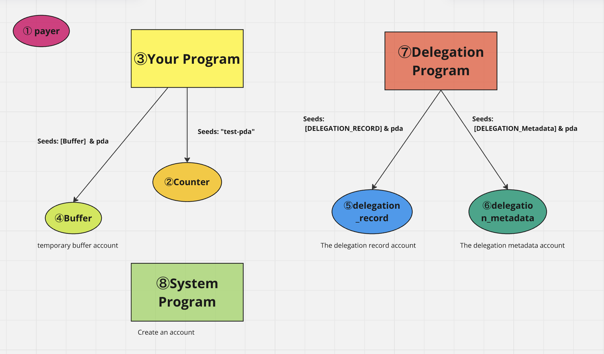

### 1 Deploy the sample counter program

1 git clone 
git clone https://github.com/ytakahashi2020/magicblock_test.git

2 Change wallet  
change into your test wallet in Anchor.toml

3 Build  
anchor build

4 Deploy  
anchor deploy

### 2 Update a delegation function

1 set dependencies

ephemeral-rollups-sdk = { version = "0.0.6", features = ["anchor"] }

2 set #[delegate] on the program  
#[delegate]

3 set use  
use ephemeral_rollups_sdk::anchor::{delegate, DelegationProgram};  
use ephemeral_rollups_sdk::cpi::delegate_account;

4 set DelegateInput Struct  

1) payer -> Signer
2) pda
3) owner_program -> this program(create::id())
4) buffer -> pda
5) delegation_record -> pda seeds::program delegation_program
6) delegation_metadata -> pda seeds::program delegation_program
7) delegation_program -> program 
8) system program -> program

5 set the delegate function

delegate function
